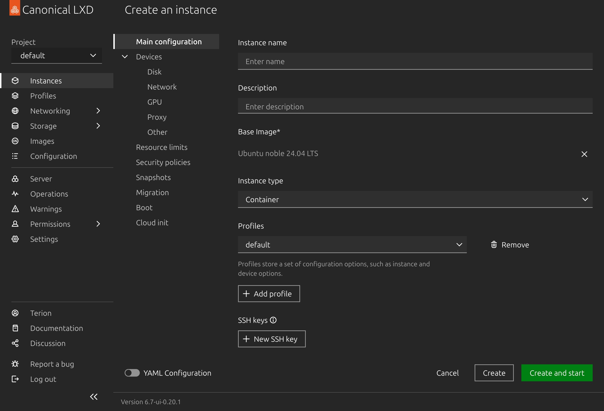

# Creating Your First Instance

After you finish installing Terrarium, the host server is fully configured, secured, and ready. You never actually need to touch the command line again if you prefer a visual workflow.

All of your host management (storage, network, system logs) can be done through the **Cockpit** dashboard. All of your container management (creating environments, routing traffic, taking snapshots) can be done through the **LXD UI**.

This guide covers how to spin up your very first container and publish an app to the web.

## 1. Creating the Container

You can choose whether you want to work through the browser or the terminal. Both paths do exactly the same thing.

### The Visual Way (LXD UI)

1. Open your LXD dashboard at `lxd.<your-domain>`.
2. Navigate to the **Instances** tab on the left sidebar.
3. Click the **Create instance** button.
4. Select the `ubuntu/24.04` image.
5. Give the container a clear name (for example, `my-first-app`).
6. Click **Create** and wait a few seconds for the container to start.



### The Command Line Way

If you prefer the terminal, you can create the exact same container in one command. SSH into your Terrarium host and run:

```bash
lxc launch ubuntu:24.04 my-first-app
```

*(By default, Terrarium automatically applies its secure container profile, which puts the container on the private `terrarium-ovn` network and gives it its own isolated ZFS storage.)*

## 2. Setting Up an Application

Now that the container exists, you can run whatever you want inside of it.

For this example, let's just run a tiny, temporary web server.

**From the LXD UI:**
1. Click on your `my-first-app` instance.
2. Go to the **Console** tab to open a terminal directly inside the container.

**From the CLI:**
```bash
lxc exec my-first-app -- bash
```

Once you are inside the container's shell, run this command to start a simple Python web server on port `8080`:

```bash
python3 -m http.server 8080
```

Right now, that web server is running entirely privately. It is only accessible to other containers on your Terrarium network. The public internet cannot see it.

## 3. Publishing the Route

To expose this web server to the internet, you just need to add a `user.proxy` label to the container. 

Terrarium watches for these labels. When it sees one, it automatically configures Traefik to route the traffic, provisions an SSL certificate, and opens the necessary internal firewall rules.

### The Visual Way (LXD UI)

1. In the LXD UI, click on your `my-first-app` instance.
2. Go to the **Configuration** tab.
3. Click **Edit YAML**.
4. Under the `config:` block, add your proxy label. It should look like this:

```yaml
config:
  user.proxy: https://my-app.example.com:8080
```

5. Click **Save**.

### The Command Line Way

On the Terrarium host terminal (not inside the container), run:

```bash
lxc config set my-first-app user.proxy "https://my-app.example.com:8080"
```

## 4. Applying the Change

Terrarium scans your containers for new proxy labels automatically every 60 seconds. If you don't want to wait a minute for your new site to come online, you can force it to sync immediately.

**From the CLI:**
```bash
terrariumctl proxy sync
```

That is the entire workflow. You have successfully created an isolated environment, started a service, and securely routed public internet traffic to it.

*(Want to lock that app so only you can access it? Check out the [Protecting Services with OIDC](../guides/auth-protection.md) guide.)*
