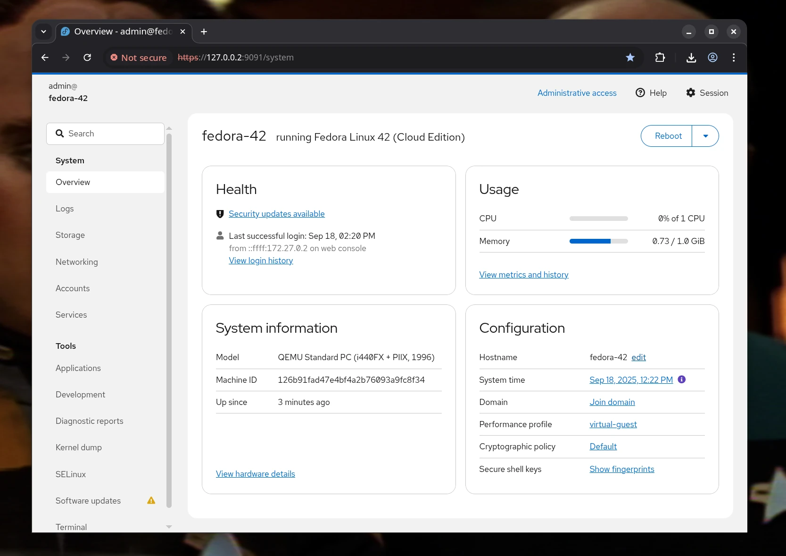
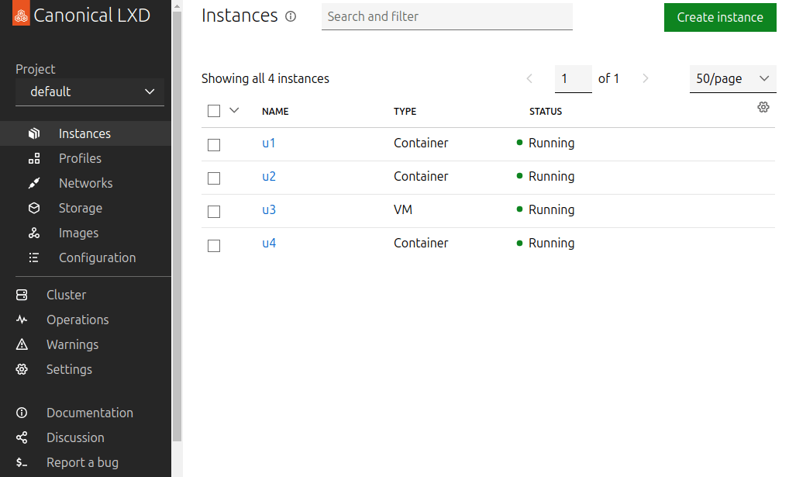
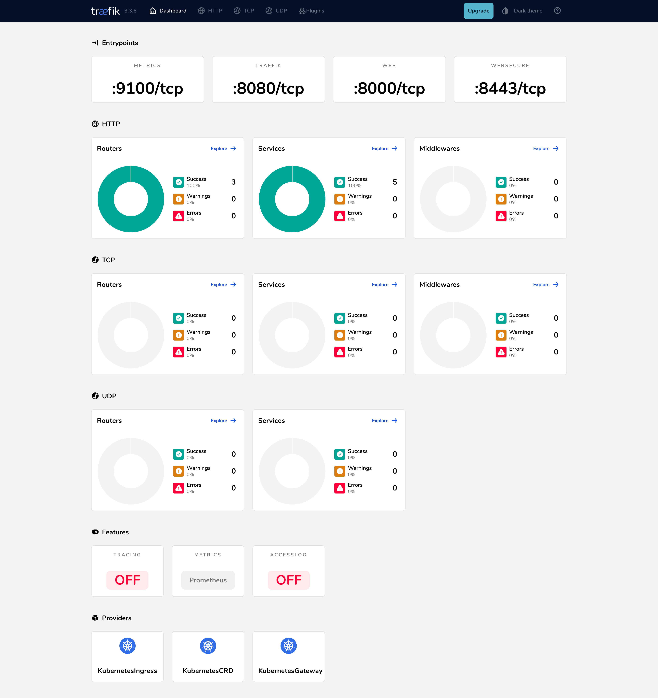

# Management GUIs

You shouldn't have to memorize a hundred command-line flags just to see what your server is doing. 

One of Terrarium's best features is that it comes with a suite of beautiful, browser-based management dashboards right out of the box. Whether you're checking server health, launching new containers, or troubleshooting network traffic, there is a visual interface ready to help.

By default, these dashboards are located at:
- **Cockpit (Host Management):** `manage.<your-domain>`
- **LXD (Container Management):** `lxd.<your-domain>`
- **Traefik (Network Routing):** `proxy.<your-domain>`

*Note: All of these dashboards are secured behind Terrarium's Single Sign-On (SSO) gate. Only users in your admin group can access them.*

---

## Cockpit (Host Management)
**Your server's mission control.**

Cockpit gives you a high-level view of your entire server. It's the perfect place to start when you want to:
- Check CPU, memory, and network usage.
- Read system logs without typing `journalctl`.
- Open a web-based terminal directly to the host.
- Manage firewall rules.

Terrarium also pre-installs special ZFS and S3 extensions for Cockpit, making it incredibly easy to visually manage your time-machine storage pools and backups without needing to be a ZFS expert.

  
*Source: [Cockpit project homepage](https://cockpit-project.org/)*

---

## The LXD UI (Container Management)
**Where your environments live.**

This is likely where you'll spend most of your time. The LXD UI is a sleek dashboard for managing all your isolated workloads. Use it to:
- Create, start, stop, and delete containers.
- View real-time resource usage for specific apps.
- Take and restore snapshots with the click of a button.
- Manage container profiles, networks, and storage.

  
*Source: [Canonical MicroCloud tutorial](https://documentation.ubuntu.com/microcloud/latest/tutorial/multi-member/)*

---

## Traefik Dashboard (Network Routing)
**The traffic cop.**

When you publish an app to the web (like `myapp.your-domain.com`), Traefik is the engine that routes the traffic to the correct container and handles the SSL certificate. 

The Traefik dashboard is invaluable when you need to:
- Verify that a new domain was routed correctly.
- See which apps are currently exposed to the internet.
- Debug routing issues or check which SSO middlewares are active on a route.

  
*Source: [Traefik getting started guide](https://doc.traefik.io/traefik/getting-started/docker/)*

---

## Summary: Which UI should I use?

- **Use Cockpit** when you want to look at the physical server, manage ZFS storage, or read system logs.
- **Use the LXD UI** when you want to spin up a new app, restart a container, or restore a snapshot.
- **Use Traefik** when you want to confirm that a web address is properly pointing to your container.

*(And don't worry—if you're a terminal veteran, everything you see in these GUIs can still be done from the command line using `terrariumctl` and `lxc`.)*
